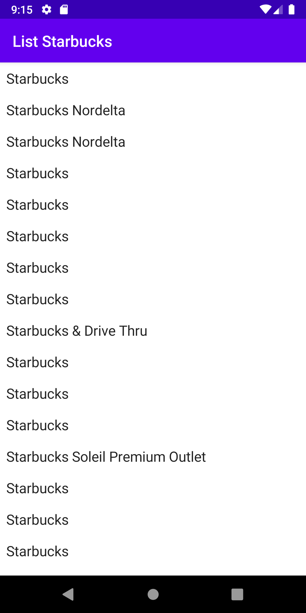
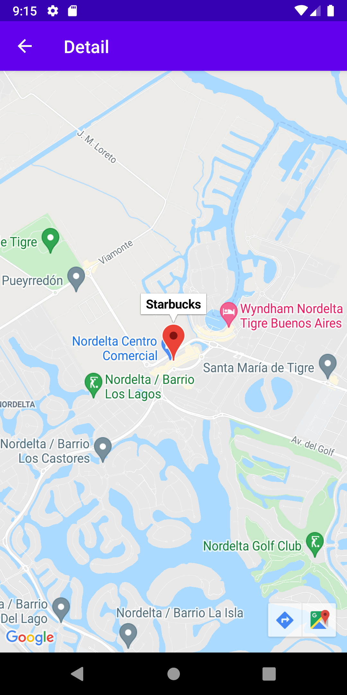

# coding challenge 2 hours

 - Kotlin, Koin, Retrofit, Gson
 - **Jetpack Compose**
 - Google Maps

Add this line with your API Key to local.properties

`MAPS_API_KEY=ADD-YOU-KEY-HERE`

## Koin 3.1.2 issue with kotlin 1.6

The app crash everytime because a koin issue:
`java.lang.NoSuchMethodError: No static method toDouble-impl(JLjava/util/concurrent/TimeUnit;)D in class Lkotlin/time/Duration; or its super classes (declaration of 'kotlin.time.Duration' appears in /data/app/com.molol.rocketin-C1cig9FOAR-vwIAEz4GrAg==/base.apk!classes10.dex)
         at org.koin.core.time.MeasureKt.measureDuration(Measure.kt:32)
         at org.koin.core.KoinApplication.modules(KoinApplication.kt:59)
         at org.koin.core.KoinApplication.modules(KoinApplication.kt:42)
         at com.molol.rocketin.BarApplication$onCreate$1.invoke(BarApplication.kt:16)`

There is a workaround initializing androidLogger in this way:
`androidLogger(if (BuildConfig.DEBUG) Level.ERROR else Level.NONE)`

## Google maps in Compose

To use google maps fragments in compose follow this article:

[Google Maps in Jetpack Compose Android](https://medium.com/geekculture/google-maps-in-jetpack-compose-android-ae7b1ad84e9)

### List

### Detail position in map

